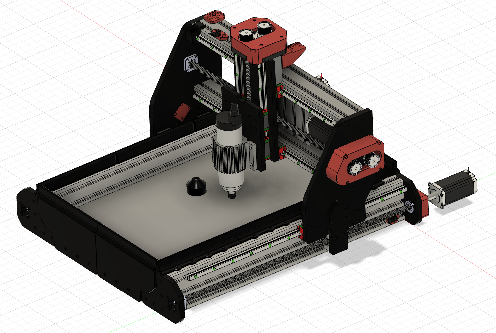
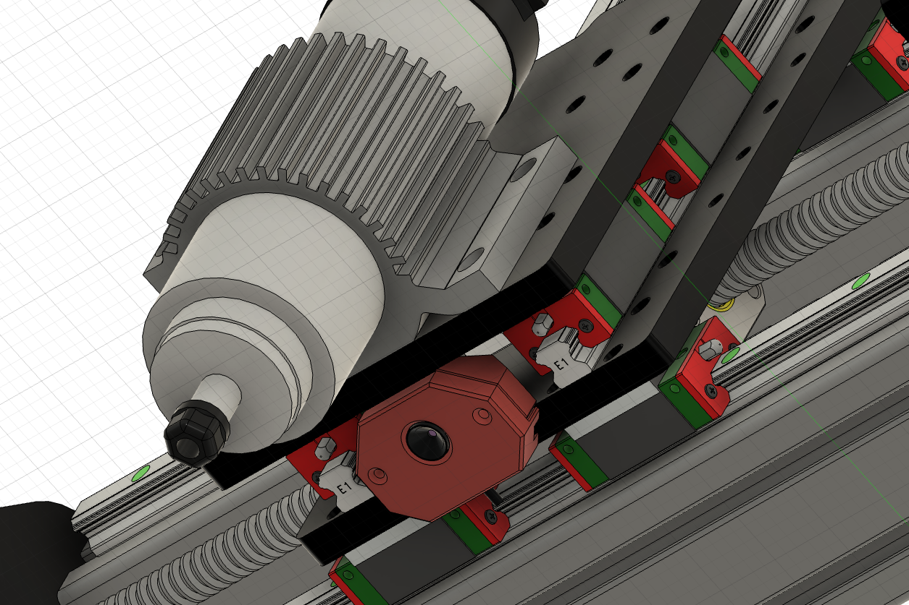

# 🦾 DIY Aluminum CNC Router (Work in Progress)

This project documents the evolution of my custom-built CNC router. Starting from a 3D-printed proof-of-concept, I am currently transitioning to a high-rigidity aluminum construction to handle more demanding materials and higher precision.

## 🚀 Key Technical Features

### 🧠 Control & Firmware
* **FluidNC:** The machine is powered by FluidNC with a custom-tailored configuration file for optimal motor tuning and peripheral management.
* **Tool Length Sensor:** Integrated probing for automatic Z-height calibration.

### 📷 Vision-Based Zeroing (Python)
To simplify the workflow, I am developing a custom **Computer Vision Assistant**:
* **USB Camera Integration:** A camera mounted near the spindle provides a live feed to a host computer.
* **Custom Python Overlay:** A self-written Python script generates a precise crosshair overlay.
* **Visual XY-Homing:** This allows for fast and highly accurate setting of the workpiece zero point (XY) without manual "paper-touching."
  

## 🏗️ Mechanical Evolution
* **Structure:** Heavy-duty aluminum plates replacing 3D-printed components.
* **Linear Motion:** High-precision rails and lead screws for minimal backlash.

---
**Status:** 🚧 *Work in Progress* Currently finalizing the aluminum frame assembly and refining the Python CV-script for better crosshair calibration.
